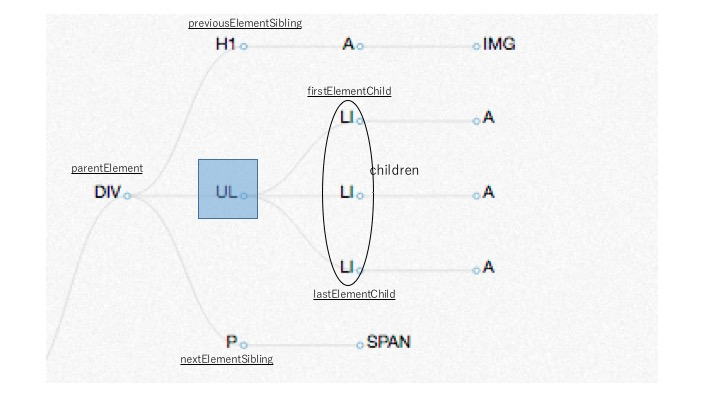

# はじめに

## 自己紹介

- (自己紹介)


## 進め方

- いつでも質問してください

- Chrome を利用する前提

- 最終日は総合演習なので、ちゃんと一つづつ理解していくことをオススメします


## ES2015, ES2016 について

JavaScript (ECMAScript) は近年進化が著しく、教科書の内容は古くなりつつあります。
しかしながら、開発現場によりまだ 旧来のJavaScript (~ES5) を使って開発がなされています。

今日以降の内容は原則、ES5までの知識で完結するようにしています。
(Promise API など一部 ES2015 にも触れますが、その時は明言するようにします)

また最終日には、JavaScriptの最近の事情について少し時間を割いてお話します。

---

# JavaScript 研修 (3日目)

#### 教科書の内容

8章、9章、11-1

#### タイムテーブル

| 時間 | 内容 |
| --- | --- |
| 10:00 - 10:50 | 1・2日目の復習 |
| 11:00 - 11:50 | 1・2日目の復習 |
| 13:30 - 14:30 | クライアントサイドJS・DevTools |
| 14:40 - 15:30 | DOM(前編)・実習(DOMの取得) |
| 15:40 - 16:30 | DOM(後編)・スタイル |
| 16:40 - 17:30 | 実習(DOM/スタイルの操作) |


---

## [13:30 - 14:30] クライアントサイドJS・DevTools

### (教科書) 8-1. クライアントサイドJavaScriptの重要性

- 複雑な機能を提供するWebアプリケーション (Not Webページ)
- サーバーサイドとは対照的に、基本的にJavaScript一本
- JavaScript の実行速度高速化に加え、新たな仕様も続々と生まれている (ES2015等は後述)
- JavaScript の役割を意識しよう (HTML/CSS/JS で重複する部分もある)


### (教科書) 8-3. 実行環境と開発環境 ＋ Projectセットアップ

#### 実行環境と開発環境
- 実行環境:
  - Webブラウザ (IE/Chrome/Firefox/etc.)
  - サーバーサイド (Node.js/io.js)

- 開発環境:
  - テキストエディタがあればできる
  - IDEの利用: HighlightやLint機能があるとGood


#### 研修用Projectのセットアップ

```
$ cd {git_repo}/client-side
$ npm install
$ npm start
```


#### Chrome/DeveloperTools を使いこなそう

今日以降 Chrome の開発者ツール (以下 DevTools) を多用します。
DevToolsが使いこなせることは、クライアントサイドJavaScriptをマスターするための前提条件、と言っても過言ではないです。

とりあえずサッと開けるようになりましょう:

- Web ページの適当な場所で 「右クリック > 要素の検証」

または

- Mac の人： ⌘ + ⌥ + i
- Windows の人：Ctrl + Shift + i


### (教科書) 8-2. HTMLとJavaScript

#### とりあえず動かしてみよう

- client-side/public/sandbox/index.html を以下の内容で書き換えてみる
- http://localhost:8000/sandbox にアクセス

```html
<!DOCTYPE HTML>
<html lang="en">
  <head>
    <meta charset="UTF-8">
    <title>JavaScript Training 2015</title>
    <link rel="stylesheet" href="sample.css">
    <script src="sample.js"></script>
  </head>
  <body>
    <h1>JavaScript is Working</h1>
    <div id="img-container">
      
    </div>
  </body>
</html>
```

#### 記述方法

- 外部JavaScriptファイルの読込 (推奨)
  - 上記の例を参照。基本こちらを使用。

- script タグ
  - 上記 index.html の h1 直下に下記をペーストしてみる
  - script タグが解析された直後に実行

    ```html
    <script>
      alert('Inline Script')
    </script>
    ```

- 他にもこんなパターンが…
  ```html
  
  <a href="javascript: alert('Link Clicked!')"></a>
  ```

#### 実行タイミング

- onload
  - 画像を含むページの全コンテンツが読み込まれた後で実行される
  - 画像の読込みが重い場合JSの実行までの待ち時間が長くなってしまう

- DOMContentLoaded
  - HTMLの解析が終わって、DOMTreeの構築が完了したタイミング
  - 多くの場合、JavaScriptでのDOM操作する実行タイミングに適する


#### DevTools で実行タイミングを確かめる


- Network タブ: Network Throttling で低速なネットワーク環境を再現して、画像の読み込み時間を体感しよう
- Timeline タブ: load 完了までレコード、DOMContentLoaded と onload のタイミングを測ってみる


### (教科書) 8-4. デバッグ

#### alert, console

DevTools/console 上で色々叩いてみる
- alert(...)
- console.log(...)
- console.dir(...)

#### ステップ実行

- ソース・ファイルに debugger を書く方法:
  - sample.js 内に "debugger" 配置してみる

- DevTools/Sources 上で Breakpoint 設定:
  - sample.js を開き行番号

- 変数の保持する値/オブジェクトを確認できる

#### ネットワーク監視

- DevTools/Network タブを見てみる


### (教科書) 8-5. クロスブラウザ対応

- 主にIE8以前のバージョンで互換性の問題があった、そういう問題が存在し得るというレベルの理解でOK
- すでに過去の話になりつつある
- ※最新の標準仕様に対する実装度合いや先行実装に関しては違いはあります


### (教科書) 8-6. Windowオブジェクト

```js
window === window.window
this === window
```


---

## [14:40 - 15:30] DOM (前編)


### (教科書) 9-1. DOM とは

#### DOMとは

- DOM = Document Object Model
- HTMLを文字列のまま操作するのも可能だが、より便利に文書の要素を参照したり操作するためのAPI


#### DOM の構造


https://29reach.com/2017 を Firefox の 3D View で表示したもの


http://domtree.breckyunits.com/?v=2 にて 肉リーチのサイトを解析したもの

※ 実際には document ノードが最上位で、body は2層目


#### レンダリング処理とDOM


[「ブラウザの仕組み」](http://www.html5rocks.com/ja/tutorials/internals/howbrowserswork/) より抜粋


#### DOMとJavaScriptの関係

DOM は JavaScriptの仕様(ECMAScript) とは別物

- ECMAScript の標準化団体: Ecma International
- DOM の標準化団体: W3C
  - (DOMのJava実装もある)


### (教科書) 9-2. DOMの基礎

- タグ(Tags) ≒ 要素(Elements)
- 要素(Elements) は ノード(Nodes)の一種
  - ただの文字列部分も　textNode

- document オブジェクトが DOMツリー上の Root
  - グローバル変数であり、 document または window.document でアクセスできる


### (教科書) 9-3. ノードの選択

#### ID による検索

```js
var element = document.getElementById("some-id");
```

- IDはDOMツリー上で一意である必要

- 実際にやってみる:
  - (BizReach Woman)[https://woman.bizreach.jp/] にアクセス
  - DevTools/Elements にて "jsi" で検索
  - DevTools/console にて見つけたIDで要素を取得してみる、console.dir してみる


#### タグ名, クラス名 による検索

```js
// byTagName
var spanElements = document.getElementsByTagName("span");
var spanElements = document.getElementsByTagName("*");

// byClassName
var elements = document.getElementsByClassName("some-class");
```


#### 親・子・兄弟

- Element編

  


- Node編
  - parentNode, childNodes, firstChild, etc..
  - Element(タグ) とは限らない


#### Selectors API

- CSS の Selectorと同じ記法で要素を取得できる
  - 詳しくは [MDNのリファレンス](https://developer.mozilla.org/ja/docs/Web/CSS/Reference#Selectors)
- querySelector と querySelectorAll

```
document.querySelector("#foo"); //ID指定

document.querySelectorAll(".some-class"); //クラス指定

document.querySelectorAll("div.some-class > a"); //タグ名

document.querySelector("#foo div:last-child"); //子孫セレクタ
```

- XPath(9-3-6) はより柔軟な表現が可能だが、CSS Selectorの利用で一般的な用途を満たせる


#### ライブオブジェクト

- こういう問題にあたったら思いだせば良い
  - パフォーマンス問題: 毎回問い合わせるからコスト高い
  - 思わぬバグの原因: (ライブオブジェクトだと思ってたけど違う、その逆)

```js
var h3List = document.getElementsByTagName("h3");
console.log(h3List.length);

var newH3 = document.createElement("h3");
document.body.appendChild(newH3);

console.log(h3List.length); // !?
```


#### 実習

- http://localhost:8000/stage1 にアクセスしてみよう

- client-side/public/stage1/tests.js の内容を書き換え全テストをGreenにしよう


---

## [15:40 - 16:30] DOM (後編)

### 9-4, 9-5, 9-6 ノードの作成・追加・内容変更・削除

```
// 作成・追加
var div = document.createElement('div');
document.body.appendChild(div);

var text = document.createTextNode('hoge');
div.appendChild(text);

// 内容変更
oldNode.parentNode.replaceChild(newNode, oldNode);

// 削除
targetNode.parentNode.removeChild(targetNode);
```


### 9-7. innerHTML/textContent

- createElementなどよりこちらの方が手っ取り早い

```
var fooElement = document.getElementById('foo');
fooElement.innerHTML = '<div>This is a new div element.</div>';

var barElement = document.getElementById('bar');
barElement.textContent = 'This is a new text.'
```


### 9-8. DOM操作のパフォーマンス

- DOM操作の度に、下図のような一連の処理が走るので、重たい処理
- 10個要素を追加するなら、LOOPで10回操作するよりも10個の要素を一度に操作した方がパフォーマンスが良い


[「ブラウザの仕組み」](http://www.html5rocks.com/ja/tutorials/internals/howbrowserswork/) より抜粋


### 11-1. スタイル

[注] 現実にはJavaScriptで直接スタイルを操作することは稀です (下記で話す class の付け外しで対応するのが基本)
しかし、CSSの研修では無いので少々レガシーな方法含めて学びます。

0. class を付け外しする (推奨)
0. style プロパティを変更する (レガシー)
0. スタイルシートそのものを変更する (特殊)

#### [方法1] Class の付け外し

最も一般的な方法

```html
<style>
  .foo-before {
    background-color: white;
    color: black;
  }
  .foo-after {
    background-color: black;
    color: white;
  }
</style>
<script>
  setTimeout(function(){

    element.classList.remove('foo-before');
    element.classList.add('foo-after');

  }, 5000);
</script>
```

#### [方法2] Styleプロパティを変更する

style プロパティを直接書き換える方法です。
"!important" を使用したCSS定義を除き再優先で適用されます。

```js
element.style.color = "blue";
element.style.fontSize = "20px";
```


#### [方法3] スタイルシートそのものを変更する

特殊な用途でのみ使われる。
(テーマを切り替えられるCMS系システムなど？)

```html
<link id="simple-css" rel="stylesheet" href="simple-theme.css">
<link id="colorful-css" rel="stylesheet" href="colorful-theme.css" disabled>

<script>
  document.getElementById("simple-css").disabled = true;
  document.getElementById("colorful-css").disabled = false;
</script>
```


#### アニメーション

一般的にシンプルなアニメーションはCSS3を利用すれば実現すべき。
しかしながら、未だJSで込み入ったアニメーションを実現する必要がある場合もある。

```js
var img = document.createElement('img');
img.src = 'https://www.bizreach.jp/img/contents/executive/dena_namba/dena-namba-interview01.png';
img.style.position = 'fixed';
img.style.width = "100px";
img.style.top = "0px";
img.style.left = "0px";

document.body.appendChild(img);

var count = 0;
setInterval(function() {
  img.style.left = count * 10 + 'px';
  count++;
}, 100);
```


---

## [16:40 - 17:30] 実習 (DOMの操作・スタイルの操作)

- http://localhost:8000/stage2 にアクセスしてみよう

- client-side/public/stage2/tests.js の内容を書き換え全テストをGreenにしよう


---

---

---

---

---


# JavaScript 研修 (4日目)

#### 教科書の内容
10章, 11-2, 11-3, 12-1 ~ 12-7

#### タイムテーブル

| 時間 | 内容 |
| --- | --- |
| 10:00 - 10:50 | 10章 イベント |
| 11:00 - 11:50 | 実習(イベント) |
| 13:30 - 14:30 | 12章 ライブラリ/jQuery |
| 14:40 - 15:30 | 実習 (DOM操作 jQuery版) |
| 15:40 - 16:30 | 11-2 AJAX, 11-3 フォーム |
| 16:40 - 17:30 | 実習 (AJAX, フォーム) |


---

## [10:00 - 10:50] 10章 イベント

### 10-1. イベントドリブンプログラミング

- クライアントサイドJavaScriptに限らず、GUIアプリケーション全般で一般的な実装方法
- イベント: クリック、Enterキーを押す、マウスを動かす、etc..
- イベントリスナ: イベントの発生を監視し、イベント発生時に事前に登録された処理を実行する


```js
element.addEventListener('click', function(event){
  console.log(event);
});
```

### 10-2. イベントハンドラ/イベントリスナの設定

イベントリスナの設定には色々な方法があります

#### HTML要素の属性に指定する

```html
<input type="button" value="Click Me!" onclick="console.log('clicked!');">
```

#### DOM要素のプロパティに指定する

```js
element.onclick = function(event) {
  console.log(event);
}
```

HTML属性やDOM要素のプロパティへの指定がすでに存在していた場合、上書いてしまう

#### addEventListener を利用する (従来推奨されてきた、が…)

- 前述の方法と異なり同一の要素に対し複数のイベントリスナを登録可能
- 同一の要素xイベントに対し、複数の処理が登録されている場合は、登録順で実行される (DOM Level3 の定義)

```js
element.addEventListener('click', function(event){
  console.log(event);
});
```


#### JSフレームワーク次第で

昨今のライブラリ/フレームワークでは、必ずしも addEventListener による登録を採用していない。
利用しているフレームワーク毎の流儀に従いましょう。

```html
<!-- AngularJS 1.x -->
<button ng-click="doSomething()"> Do Something </button>

<!-- AngularJS 2.x -->
<button (click)="doSomething()"> Do Something </button>

<!-- ReactJS -->
<button onClick={doSomething}> Do Something </button>

<!-- jQuery -->
<script>
  buttonElement.on('click', doSomething)
</script>
```


### DevTools で イベントリスナを確認してみよう


[BizReach Woman](https://woman.bizreach.jp/) より


### 10-3. イベント発火

- mousemove などはマウスが動いいてる間じゅう発火しつづけるので使用に注意


### イベントリスナの仕組み

どうやってイベントリスナ設定するかは上記の通り。
けど、どういう順序で処理されているか分からない人がいると思います。

- [ここ](http://latentflip.com/loupe/?code=Ly8gTWFpbgpjb25zb2xlLmxvZygiSGkhIik7CmNvbnNvbGUubG9nKCJXZWxjb21lISIpOwoKCgovLyAvLyBDYWxsIFN0YWNrCi8vIG91dGVyKCk7CgovLyBmdW5jdGlvbiBvdXRlcigpewovLyAgICAgaW5uZXIoKTsKLy8gfQoKLy8gZnVuY3Rpb24gaW5uZXIoKXsKLy8gICAgIGNvbnNvbGUubG9nKCdpbm5lciEnKTsKLy8gfQoKCgovLyAvLyBXZWIgQVBJJ3MgJiBDYWxsYmFjayBRdWV1ZQovLyAkLm9uKCdidXR0b24nLCAnY2xpY2snLCBmdW5jdGlvbiBvbkNsaWNrKCkgewovLyAgICAgY29uc29sZS5sb2coJ1lvdSBjbGlja2VkIHRoZSBidXR0b24hJyk7ICAgIAovLyB9KTsKCgoKLy8gLy8gNSBzZWMgaXMgbm90IGFzc3VyZWQhCi8vIHNldFRpbWVvdXQoZnVuY3Rpb24gdGltZW91dCgpIHsKLy8gICBjb25zb2xlLmxvZygiNSBzZWNvbmRzISIpOwovLyB9LCA1MDAwKTsKCgoKLy8gLy8gTmVzdGVkIEFzeW5jIEZ1bmN0aW9ucwovLyAkLm9uKCdidXR0b24nLCAnY2xpY2snLCBmdW5jdGlvbiBhc3luY091dGVyKCl7Ci8vICAgICBzZXRUaW1lb3V0KGZ1bmN0aW9uIGFzeW5jSW5uZXIoKXsKLy8gICAgICAgICBjb25zb2xlLmxvZygnNSBzZWNvbmRzIGZyb20gY2xpY2shJyk7Ci8vICAgICB9LCA1MDAwKTsKLy8gfSk7!!!PGJ1dHRvbj5DbGljayBtZSE8L2J1dHRvbj4%3D) にアクセスして "Save+Run" を押してみよう


### 10-4. イベントの伝播 (Event Propagation)


イベントに応じた処理は下記の順で実行される:

0. Capturing フェーズ
  - ルート要素から対象(target)の要素まで降りていく
    ```js
    element.addEventListener('click', handlerFn, true)
    ```

0. Target フェーズ
  - 対象要素に辿り着くタイミング

0. Bubbling フェーズ
  - 対象要素からルート要素に昇っていく

0. ブラウザの既定(default)の処理
  - e.g. リンクを押すとページが遷移する


### 10-5. イベントが持つ要素

```js
element.addEventListener('click', function(event){
  console.log(event); // <= イベントオブジェクト

  event.stopPropagation(); // イベントの伝播を止める
  event.preventDefault(); // デフォルトの動作を中止する (e.g. リンクを押してもページ遷移させない
});
```


### 10-6. 標準イベント

(Referenceなので特に説明しません)


### 10-7. 独自イベント

(使うことはほぼ無いので特に説明しません)


---

## [11:00 - 11:50] 実習(イベント)

- localhost:8000/stage3 にアクセス

- client-side/public/stage3/tests.js を編集して全テストをGreenにしよう


---

## [13:30 - 14:30] 12章 ライブラリ/jQuery

### 12-1. ライブラリを使うべき理由

- クロスブラウザ対策

- 今日ではクロスブラウザの意義は薄れてきている
  - Vanilla.js というジョーク
  - 最終日に、「昨今のJS事情」というタイトルで話します

- 素の JavaScript/DOM API を理解していることが重要
  - 流行り廃りが激しい界隈
  - いざとなったらライブラリのソースを読めると強い

```js
// 例えばこんな関数を用意して IE8以下 に対応していたり
function bindEvent(el, eventName, eventHandler) {
    if (el.addEventListener) { // addEventListenerメソッドに対応していたら
        el.addEventListener(eventName, eventHandler, false);
    } else if (el.attachEvent) { // addEventListenerメソッドに対応していなかったら、attachEventメソッドを使う
        el.attachEvent('on' + eventName, eventHandler);
    }
}

bindEvent(element, 'click', function() {
    alert('element clicked');
});
```


### 12-2. jQuery の特徴

- 世界で一番使われているJavaScriptライブラリ

- クロスブラウザ対応
  - 1.x 系: IE6+
  - 2.x 系: IE9+ (IE6, 7, 8 はサポート外)

- jQuery


### 12-3. jQuery の基本

- 素の DOM API よりも簡潔に記述できる

```js
var $body = $('body') // body要素の取得

$('<button>Click Me!</button>')   // button 要素の作成
  .css({                          // スタイル 指定
    position: 'fixed',
    top: '300px',
    left: '300px',
    backgroundColor: 'red'
  })
  .click(function(){             // click イベントのリスナ設定
    console.log('Button Clicked!');
  })
  .appendTo($body);               // body に追加
```


### 12-4. $関数

- jQuery が返すオブジェクトはDOM要素ではなく jQueryオブジェクト ($button など $ をつける慣習がある)

```js
// DOM要素の取得
var $element1 = $('#foo div.bar');
var $element2 = $('div.bar', '#foo');

// DOM要素の作成
var $button = $('<button>Click me !</button>');

// 通常のDOM要素を jQuery オブジェクトに変換
var $jqueryElem = $(document.getElementById('#foo'));

// DOM構築後のイベントリスナ設定
$(function(){
  // 基本は DOMContentLoaded のタイミング
})
```


### 12-5. jQuery による DOM操作

参考: http://www.detelu.com/blog/2011/11/jquery-selector-traversing/


#### 12-5-1. 要素の取得

- 標準のSelectorに加え、様々な独自Selectorがある
- Selector に加えて、便利なメソッドでの取得可能

```js
$('#foo').find('div.bar');  // #foo の全子要素の内 <div class="bar">
$('#foo').children('a');    // #foo の直下の子要素の内 <a>
```

#### 12-5-2. 要素の作成・追加・置換・削除

```js
$element.append(newElement); // element.appendChild(newElement)
$element.text(someText);    // element.textContent = someText
```

### 12-6. jQuery によるイベント処理

- とりあえず on さえ知っていればOK
- 詳しく知りたい人は bind/live/delegate の仕組みを理解
- ちなみに live は jQuery 1.9 で廃止されてるので注意

```js
// イベント設定基本
$('#foo').on('click', function(){
  // Do Something
});

// よく使うものはメソッドとしても用意されてる
$('#foo').mouseover(function(){
  // Do Something
});

// DOMContentLoaded的なもの
$(function(){
  // Do Something
});
```

参考: http://tacamy.hatenablog.com/entry/2013/03/03/213113


### 12-7. jQuery による スタイル操作

#### 12-7-1 スタイル操作

```js
// CSS
$element.css('width');
$element.css({ width: '100px', height: '100px' });

// Class
$element.hasClass('active');
$element.addClass('active');
$element.removeClass('active');

...
```

### 12-7-2 アニメーション

```js
var $img = $('')
  .attr('src', 'https://www.bizreach.jp/img/contents/executive/dena_namba/dena-namba-interview01.png')
  .css({
    width: 100,
    position: 'fixed',
    top: 0,
    left: 0
  })
  .appendTo(document.body);

var afterAnimation = { top: window.outerHeight, left: window.outerWidth };

$img.animate(afterAnimation, 3000);
```


### 12-3 Column メソッドチェーン

- jQuery では "メソッドチェーン"を多用します
- 返り値は、同一オブジェクト(破壊的メソッド)だったり、別オブジェクトだったりするので注意


「メソッドチェーンとは…」という説明より簡単なメソッドチェーンを実装してしましょう

```js
function Person(name, items) {
  this.name = name;
  this.items = items;

  this.addMutable = function(item){
    this.items.push(item);
    return this;
  }

  this.addImmutable = function(item){
    var copiedItems = [].concat(this.items);
    copiedItems.push(item);
    return new Person(this.name, copiedItems);
  }
};

// Mutable (OK)
var jiro = new Person("Jiro", []);
jiro.addMutable('book')
jiro.addMutable('pen');

// Mutable (OK)
var taro = (new Person("Taro", []))
  .addMutable('book')
  .addMutable('pen');

// Immutable (NG)
var hanako = new Person("Hanako", []);
hanako.addImmutable('book');
hanako.addImmutable('pen');

// Immutable (OK)
var noriko = new Person('Noriko', []);
var noriko2 = noriko.addImmutable('book')
var noriko3 = noriko2.addImmutable('pen');

// Immutable (OK)
var momoko = (new Person('Momoko', []))
  .addImmutable('book')
  .addImmutable('pen');
```


### 12-12. ライブラリの利用方法


- CDN を利用する
  - 外部サーバー依存だが、お手軽
  - npmcdn, cdnjs, jsdelivr など (教科書に載っている google-code はサービス終了済)

  ```
  <script type="text/javascript" src="https://cdnjs.cloudflare.com/ajax/libs/jquery/3.0.0/jquery.min.js"></script>
  ```

- 依存管理ツールを利用する
  - bower, npm など
  - この研修プロジェクトも npm, bower を利用しています


---

## [14:40 - 15:30] 実習 (DOM操作 jQuery版)

- localhost:8000/stage4 へアクセス

- client-side/public/stage4/tests.js を修正して全テストをGreenにしよう


---

## [15:40 - 16:30] 11-2. AJAX

- 12-8. jQuery による AJAX, 12-9. Deferred に対応するトピックを取り上げます

- 利用するライブラリ:
  - [axios](https://github.com/mzabriskie/axios)
    - 「12-8. jQueyr による AJAX」に対応
  - ES2015 Promise (Chrome Native実装)
    - 「12-9. Deferred」に対応
    - 参考: [JavaScript Promise の本](http://azu.github.io/promises-book/)

- 独自API

### 11-2 AJAX

- 今日では基本的かつ重要な技術
- AJAX = Asynchronous JavaScript + XML
- ページを遷移せずにサーバーからコンテンツを非同期にロードし、ページを書き換える


#### 同期 vs 非同期

サーバーとの通信はネットワークを経由するため、一定の時間(数十ミリ秒 ~ 数秒) がかかります。
そのため、リクエストを送ってからレスポンスが返ってくるまでの間に、他の処理を止めて待っているとUXがガタガタなアプリケーションになります。
その待ち時間に、他の処理を進めておく様子を「非同期」と呼んでいます。

↑ではよく分かんないので、同期的な処理と非同期な処理を見てみましょう
client-side/public/sandbox/ajax.html を見てみましょう

```html
<html lang="en">
  <head>
    <!-- JS Libraries -->
    <script src="/bower_components/axios/dist/axios.js"></script>
    <script src="/bower_components/jquery/dist/jquery.js"></script>
    <script src="ajax.js"></script>
  </head>

  <body>
    <h2>Sync vs. Async</h2>

    <button id="button">Get Users</button>

    <div>
      <span id="counter"></span>
    </div>

    <pre id="users"></pre>


    <!-- Sync vs. Async -->
    <script>

      startCounting(); // 目盛りが増える

      onButtonClick(function(){

        addText("[Request]");

        // Async: true
        requestUsers(true, function(users){
          printUsers(users);
          addText("[Response]");
        });

        addText("[End]");
      });

    </script>

  </body>
</html>
```


#### 非同期処理のイメージ(再掲)

- [ここ](http://latentflip.com/loupe/?code=Ly8gTWFpbgpjb25zb2xlLmxvZygiSGkhIik7CmNvbnNvbGUubG9nKCJXZWxjb21lISIpOwoKCgovLyAvLyBDYWxsIFN0YWNrCi8vIG91dGVyKCk7CgovLyBmdW5jdGlvbiBvdXRlcigpewovLyAgICAgaW5uZXIoKTsKLy8gfQoKLy8gZnVuY3Rpb24gaW5uZXIoKXsKLy8gICAgIGNvbnNvbGUubG9nKCdpbm5lciEnKTsKLy8gfQoKCgovLyAvLyBXZWIgQVBJJ3MgJiBDYWxsYmFjayBRdWV1ZQovLyAkLm9uKCdidXR0b24nLCAnY2xpY2snLCBmdW5jdGlvbiBvbkNsaWNrKCkgewovLyAgICAgY29uc29sZS5sb2coJ1lvdSBjbGlja2VkIHRoZSBidXR0b24hJyk7ICAgIAovLyB9KTsKCgoKLy8gLy8gNSBzZWMgaXMgbm90IGFzc3VyZWQhCi8vIHNldFRpbWVvdXQoZnVuY3Rpb24gdGltZW91dCgpIHsKLy8gICBjb25zb2xlLmxvZygiNSBzZWNvbmRzISIpOwovLyB9LCA1MDAwKTsKCgoKLy8gLy8gTmVzdGVkIEFzeW5jIEZ1bmN0aW9ucwovLyAkLm9uKCdidXR0b24nLCAnY2xpY2snLCBmdW5jdGlvbiBhc3luY091dGVyKCl7Ci8vICAgICBzZXRUaW1lb3V0KGZ1bmN0aW9uIGFzeW5jSW5uZXIoKXsKLy8gICAgICAgICBjb25zb2xlLmxvZygnNSBzZWNvbmRzIGZyb20gY2xpY2shJyk7Ci8vICAgICB9LCA1MDAwKTsKLy8gfSk7!!!PGJ1dHRvbj5DbGljayBtZSE8L2J1dHRvbj4%3D) にアクセスして "Save+Run" を押してみよう


#### XMLHttpRequest と ショートハンドAPI

標準の AJAX API はこんな感じ (使わないと思う)

```js
var xhr = new XMLHttpRequest();
xhr.onreadystatechange = function() {
    if (xhr.readyState == 4 && xhr.status == 200) {
        console.log(xhr.response);
    }
};
xhr.open('GET', '/api/users');
xhr.send(null);
```

<br/>
<br/>

普通は axios 等のライブラリを利用する ( axios.get(..) )

その他ライブラリ:
- [jQuery.ajax](https://github.com/mzabriskie/axios)
- [superagent](https://github.com/visionmedia/superagent)
- [Angular の $http](https://docs.angularjs.org/api/ng/service/$http)


```js
axios
  .get('/api/friends')
  .then(function(response) {
    console.log(response.data);
  })
  .catch(function(error) {
    console.error(error)
  });


// GET 以外
axios.delete(url)
axios.post(url, data)
axios.put(url, data)
```


### 12-9. Promise

```js
var something = axios.get(..)
something.then(..)
something.catch(..)
```

この something の実体は、Promise オブジェクトと言います。
ES2015 によって、ECMAScript 標準のAPIになりました。

PromiseはAJAXに限定された考え方ではなく「非同期処理をいい感じに扱える仕組み」です


#### 「いい感じ」って何？

Promise以前の世界: いわゆるコールバック地獄

```js
function after3Sec(callback){
  setTimeout(function(){
    callback();
  }, 3000);
}


// 3秒後, その3秒後(6秒後), その3秒後(9秒後)... と順に処理をしたい場合

after3Sec(function(){
  console.log("3 seconds passed!");

  after3Sec(function(){
    console.log("6 seconds passed!");

    after3Sec(funciton(){
      console.log("9 seconds passed!");
    });
  });
});

```

Promiseのある世界

```js
function after3Sec(){
  return new Promise(function(resolve){
    setTimeout(function(){
      resolve();
    }, 3000);
  })
}


after3Sec()
  .then(function() { console.log('3 seconds passed!'); })
  .then(after3Sec)
  .then(function() { console.log('6 seconds passed!'); })
  .then(after3Sec)
  .then(function() { console.log('9 seconds passed!'); })
```


#### Resolve/Reject と Then/Catch


```js
function checkNumberAsync(input){
  return new Promise(function(resolve, reject){
    setTimeout(function(){
      if(typeof input === 'number'){
        resolve("YES");
      } else {
        reject("NO");
      }
    }, 2000);
  }) ;
}

// Resolve -> Then
checkNumberAsync(1)
  .then(function(result) {
    console.log(result);
  })
  .catch(function(error){
    console.log(error);
  });

// Reject -> Catch
checkNumberAsync("Hello")
  .then(function(result) {
    console.log(result);
  })
  .catch(function(error){
    console.log(error);
  });
```


- axios の場合
  - HTTP Status 200以上300未満 の場合 -> Resolve
  - それ以外の場合 -> Reject


#### Promise便利メソッド

上記で上げた３秒毎の例は、「直列非同期処理」ですが、これ以外にも複雑な処理は様々…
- 並列非同期処理: 複数の非同期処理が全て完了を待ち合わせる処理
- 複数の非同期処理の内、最速で完了したものだけ待つ処理

```js
// 直列非同期処理
axios
  .get('/api/echo/foo')
  .then(function(resToFoo) {
    console.log(resToFoo);
    return axios.get('/api/echo/bar')
  })
  .then(function(resToBar){
    console.log(resToBar);
    return axios.get('/api/echo/buz');
  })
  .then(function(resToBuz) {
    console.log(resToBuz);
  });

// 並列非同期処理
Promise.all([
  axios.get('/api/echo/foo'),
  axios.get('/api/echo/bar')
])
.then(function(resList){
  var resToFoo = resList[0];
  var resToBar = resList[1];
  console.log(resToFoo, resToBar);
});


// Race
Promise.race([
  axios.get('/api/users?delay=1000'),
  axios.get('/api/echo/hoge')
])
.then(function(winner) {
  console.log(winner.data)
});
```


#### 11-2-7. クロスオリジン制限

- オリジン(origin): URLプロトコル・ホスト名・ポート番号で構成される要素 (e.g. http://example.com:8080 )

- 特定の origin のページから、異なる origin への AJAX リクエストは基本はできない (セキュリティ上の理由)

- 色々 Cross-Origin を超える方法がある

  ```
  // XMLHttpRequest Level2
  curl -I https://api.github.com/gists/public

  Access-Control-Allow-Origin:*
  ```


### 独自APIの仕様

```
/*
 * ユーザ全件取得:
 * 全ユーザを取得します
 */
GET /api/users

// レスポンス例:
[
  {"id":0,"name":"Taro","friends":[1,2]},
  {"id":1,"name":"Jiro","friends":[0]}
]
```

```
/*
 * ユーザ１件取得:
 * IDで指定したユーザ情報を１件取得します
 * 該当するユーザがいない場合 404 Not Found が返ってきます
 */
GET /api/users/:id

// レスポンス例:
{"id":0,"name":"Taro","friends":[1,2]}
```

```
/*
 * ユーザ１件追加:
 * ユーザ１人追加します(残念ながらfriendsは作ってあげられません)
 * name が指定されていない場合 400 Bad Request が返ってきます
 */
POST /api/users

// リクエスト例:
{ "name": "Shiro" }

// レスポンス例:
{ "id": 100 } // 追加されたユーザのID
```

```
/*
 * Echo:
 * 指定した文字列をそのまま返却する
 */
GET /api/echo/:msg

// レスポンス例:
{ "msg": "hoge" } // "msg" に指定した文字列を返す
```

- 通信の遅さを体感するために各APIに "/api/users?delay=5000" などと指定すると指定されたミリ秒だけレスポンスが遅れるようになっています
- 追加APIで追加したユーザはサーバを立ち上げ直すと消えてしまいます(なんちゃってDBのため)


---

## [16:40 - 17:30] 実習 (AJAX, フォーム)

- localhost:8000/stage4 にアクセスしましょう
- client-side/public/stage4/tests.js を編集してみましょう


---

---

---

---

---


# JavaScript 研修 (5日目)

#### 教科書の内容
19章, 20章

#### タイムテーブル

| 時間 | 内容 |
| --- | --- |
| 10:00 - 10:50 | 19章 Web API, 20章 Web API の実例 |
| 11:00 - 11:50 | 総合演習 |
| 13:30 - 14:30 | 総合演習 |
| 14:40 - 15:30 | 総合演習 |
| 15:40 - 16:30 | 総合演習 |
| 16:40 - 17:30 | 最近のJS事情 |


---

## [10:00 - 10:50] 19章 Web API, 20章 Web API の実例

### Web API とは

- Web APIとは Webサービスとクライアントアプリケーション 間で、HTTPリクエストを投げてレスポンスを受け取るときの通信の規約
    - 規約の例: リクエスト先のURL定義、クエリパラメータ、レスポンスのフォーマットのこと

- AJAX セクションで利用した "GET /api/friends" も (簡易な) Web API と言える


### アーキテクチャ

- Clientアプリケーションからの利用
  - 

- Serverアプリケーションからの利用
  - 


### 利用方法

- HTTP API
  - https://developer.github.com/v3/search/#search-repositories

  ```
  GET https://api.github.com/search/repositories?q=bizreach
  ```

- 言語 API
  - https://dev.twitter.com/overview/api/twitter-libraries

  ```js
  var twitter = new Twitter(config);
  twitter.getUserTimeline({ screen_name: 'BoyCook', count: '10'}, error, success);
  ```

- Widget API
  - https://developers.facebook.com/docs/plugins/like-button?locale=ja_JP

- スクレイピング (?)
  - Google
  - Stanby


### フォーマット

- [XML](https://ja.wikipedia.org/wiki/%E7%89%B9%E5%88%A5:%E3%83%87%E3%83%BC%E3%82%BF%E6%9B%B8%E3%81%8D%E5%87%BA%E3%81%97/JavaScript)
- [Atom](http://blog.livedoor.jp/dqnplus/atom.xml)（XMLの派生）
- [JSON](https://api.github.com/orgs/twitter/repos)（最近のWeb APIでは最も一般的）
- HTML (?)


### 実際にWeb APIを利用して見よう

[公開されてるAPI一覧](http://smsurf.app-rox.com/api/)


### 実際にWeb APIを利用して見よう ~楽天編~

アカウント登録 ~ API Key 発行 は終わってますか？

- API資料:
  - [楽天API一覧](http://webservice.rakuten.co.jp/document/)
  - [テストフォーム](https://webservice.rakuten.co.jp/explorer/api/IchibaItem/Search/)
  - [楽天商品検索API](https://webservice.rakuten.co.jp/api/ichibaitemsearch/) を利用してみる

    ```js
       {
        "count": 134, // 全商品数
        "hits": 10, // このページに含まれる商品数
        "page": 1,  // 1ページ目
        "pageCount": 14, // 全部で 14 ページあるよ
        "Items": [
          { // 商品1
            "Item": {
              "itemName": "クリスタルガイザー ミネラルウォーター 500ml×48本(並行輸入品)【楽天24】[クリスタルガイザー ミネラルウォーター 軟水]【HOF19】",
              "itemPrice": 1587,
              "itemUrl": "http://item.rakuten.co.jp/rakuten24/c001222600001/",
              "smallImageUrls": [
                {
                  "imageUrl": "http://thumbnail.image.rakuten.co.jp/@0_mall/rakuten24/cabinet/e114/e114677h_l.jpg?_ex=64x64"
                }
              ],
              "shopName": "楽天24",
              "shopUrl": "http://www.rakuten.co.jp/rakuten24/",
              "genreId": "201351"
            }
          },
          { ... }, // 商品2
          { ... }, // 商品3
        ]
      }
    ```

### 実際にWeb APIを利用して見よう ~Flickr編~


- API資料:
  - [Flickr API Documentation](https://www.flickr.com/services/api/)
  - [画像検索API](https://www.flickr.com/services/api/flickr.photos.search.html)
  - [URLの組み立て](https://www.flickr.com/services/api/misc.urls.html)


#### 公開されている Web API

- http://smsurf.app-rox.com/api/

---

## [11:00 - 11:50] 総合演習
## [13:30 - 14:30] 総合演習
## [14:40 - 15:30] 総合演習
## [15:40 - 16:30] 総合演習

[こんなイメージ](http://www.itemsearch.jp/search?genre=ALL&keyword=JavaScript&display=catalog)

---

## [16:40 - 17:30] 最近のJS事情
- ES2015 / ES2016
- npm と bower
- babel, TypeScript
- ReactJS/AngularJS

---

---

---

---

---

# TODO

## By Day5
- TODO: Web API Section
- TODO: 昨今のJS事情
- TODO: value とかあんまり…
